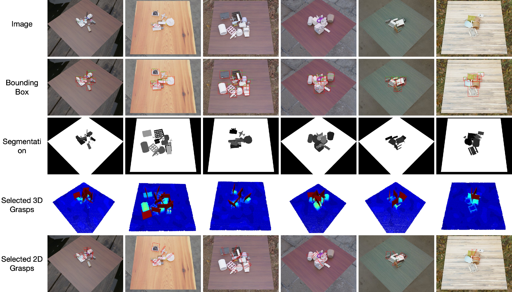

# REGRAD Dataset

  
This is a detailed decription of REGRAD Dataset.  
The Dataset can be divided into two parts, *Relation Part*  and  *Grasp Part*. Each part contains five folder, 
*train/test/seen_valid/unseen_valid/seen_test*. For every folder, the data format is the same.  
 

## Relation Part
The directory structure is as follows. Take *train* folder for example.  
```
train  
|_____ scene id  
|__________ id of different camera angles(from 1 to 9)
|________________ camera_info.json
|________________ info.json
|________________ rgb.jpg
|________________ segment.jpg
|________________ depth.png
|________________ labeled.jpg
|________________ minRect_labeled.jpg
|__________ final_state.json
|__________ mrt.json
```
### Some detailed description

- [x] *final_state.json*  
    contains the  generated scene information including *model name*、*obj_id*、*path*、*position*. This file is necessary to
    reload the scene in relation detection.
    ```angular2
    { 'name': model_name-obj_id (e.g. tower-1),
      'path': model category/model path (e.g. 04460130/de08da18d316f927a72fcffccc240663),
      'pos': xyz postion + quaternion,
  }
    ```
- [x] *mrt.json*  
    Model relation tree. Contains every model's parent list.  
    e.g.  
    ```angular2
    {"table-1": ['birdhouse-2','mug-4'], "birdhouse-2": [], "vessel-3": ['mug-4'], "mug-4": [] }
    ```
- [x] *camera_info.json*  
    contains camera extrisinc and intrisinc parameters.

- [x] *info.json*  
    contains all models information,it is a list of dictionaries. Every
    dictionary contains all information of a model.Dict keys are as follows.  
    ```angular2
    { 'model_name':(str) ShapeNet model name(e.g. tower),
  
      'category':(str) ShapeNet category(e.g. 04460130),
  
      'model_id':(str) ShapeNet model id(e.g. de08da18d316f927a72fcffccc240663),
  
      'obj_id': (int) id in the scene(e.g. 1),
  
      '6D_pose':(7-d list of float) 6D_pose of models, format [x,y,z, quaternion],
  
      'parent_list':(list) parent obj_id list, format ['model_name-obj_id1','model_name-obj_id2'],
  
      'scale':(3-d list) model scale factor in the scene, format [x_scale, y_scale, z_scale],
  
      'bbox':(4-d list) bounding box of the model, format [x1, y1, x2, y2],
  
      'MinAreaRect':(4-d list) The smallest bounding rectangle of the model, format [[x1,y1],[x2,y2],[x3,y3],[x4,y4]],
  
      'segmentation':(2-d list) segmentation region in the segment.jpg picture, format [x_position_list, y_position_list],
  
      'Source': (str) ShapeNetCore.v2,
  }
  ```
- [x] *segment.jpg*  
    For better visualize, the segment id of a model can be  computed  with *10 obj_id +1*.  
   
- [x] *labeled.jpg*  
    visualized bounding box
- [x] *minRect_labeled.jpg*  
    visualized minimum bounding box
- [x] *depth.png*  


## Grasp_Part  
As for grasping, the dataset provides both 2D and 3D grasping data. For each scene, there are 9 data files
corresponding to 9 camera angles.  
1. data loading
```angular2
    import numpy as np
    data = np.load(filepath, allow_pickle=True)
```
2. data format
```angular2
{
    'antipodal_score'  (ndarray([valid_frame_num, len(LENGTH_SEARCH),GRASP_PER_LENGTH])): The force closure property of a grasp 
    
    'vertical_score'  (ndarray([valid_frame_num, len(LENGTH_SEARCH),GRASP_PER_LENGTH])): The verticality between the grasping direction of the gripper and the table (It is more stable to perform grasping perpendicular to the desktop)
    
    'center_score'  (ndarray([valid_frame_num, len(LENGTH_SEARCH),GRASP_PER_LENGTH])): The distance between the grasp point and the center point of the object (It is more stable to perform grasping near its center)
    
    'objects_label'  (ndarray([valid_frame_num, len(LENGTH_SEARCH),GRASP_PER_LENGTH])): The object label corresponding to the point of the effective grasping part
    
    'view_cloud'  (ndarray([view_point_num, 3])): Point cloud from the camera's perspective
    
    'view_cloud_color'  (ndarray([view_point_num, 3])): Point cloud' color from the camera's perspective
    
    'view_cloud_label'  (ndarray([view_point_num, ])): The object label corresponding to each point in the point cloud from the camera's perspective
    
    'view_cloud_score'  (ndarray([valid_frame_num, len(LENGTH_SEARCH),GRASP_PER_LENGTH])): The ratio of successful grasp in a region around a given point P, which can help learn which position in P is suitable for grasping
    
    'scene_cloud'  (ndarray([scene_point_num, 3])): Complete scene point cloud (excluding table)
    
    'scene_cloud_table'  (ndarray([scene_point_num+table_point_num, 3])): Complete scene point cloud (including table)
    
    'valid_index'  (ndarray([valid_frame_num, ])): The index of the point with the effective grasping
    
    'valid_frame'  (ndarray([valid_frame_num, len(LENGTH_SEARCH),GRASP_PER_LENGTH, 4, 4])): Effective grasping
    
    'select_frame'  (ndarray([best_frame_num, 4, 4])): Grasp with the highest score (score = antipodal_score + vertical_score + center_score)
    
    'select_score'  (ndarray([best_frame_num, ])): Max of antipodal_score + vertical_score + center_score
    
    'select_antipodal_score'  (ndarray([best_frame_num, ])): Max of antipodal_score
    
    'select_center_score'  (ndarray([best_frame_num, ])): Max of center_score
    
    'select_vertical_score'  (ndarray([best_frame_num, ])): Max of vertical_score
    
    'select_frame_label'  (ndarray([best_frame_num, ])): The label of the object corresponding to each frame in select_frame
}
```
*note*   
1、To get the object-specific grasps, we sample grasps on each object separately. By sampling different grasp orientations around the approaching vector as well as the grasp depths, we generate a set of grasp candidates on each grasp point. The gripper orientations are sampled every 20 degrees from -90 to 90 degrees(THETA SEARCH), and the grasp depths are taken from the set of -0.06, -0.04, -0.02, -0.00(LENGTH SEARCH), depending on the depth in the gripper parameters.  

2.select_frame: ndarray([best_frame_num, 4, 4]):  

```
[
[normal[0],principal_curvature[0],minor_curvature[0],-center[0],  
[normal[1],principal_curvature[1],minor_curvature[1],-center[1],  
[normal[2],principal_curvature[2],minor_curvature[2],-center[2],   
[0,        0,                     0,                  1]
]
```
